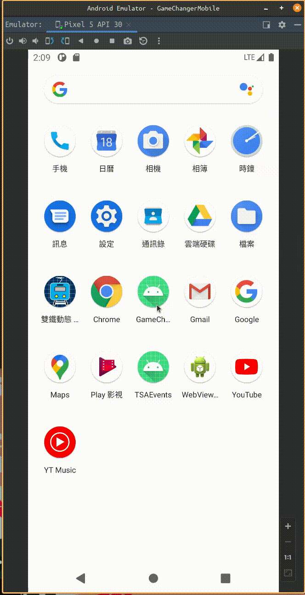
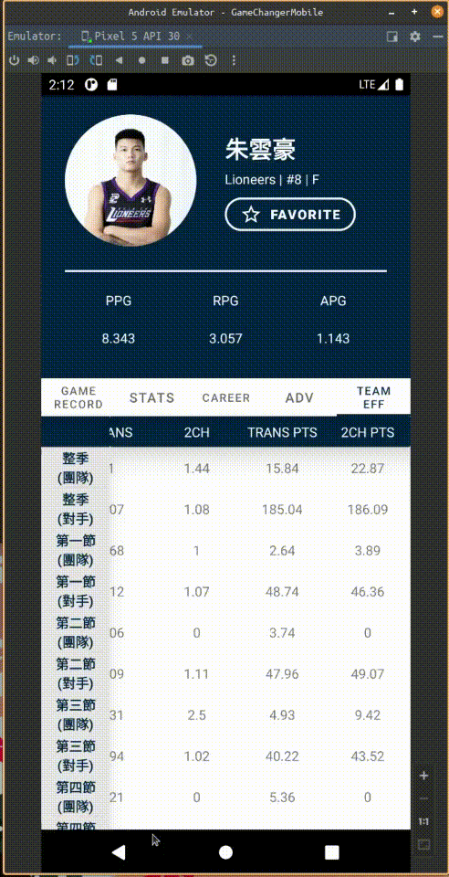
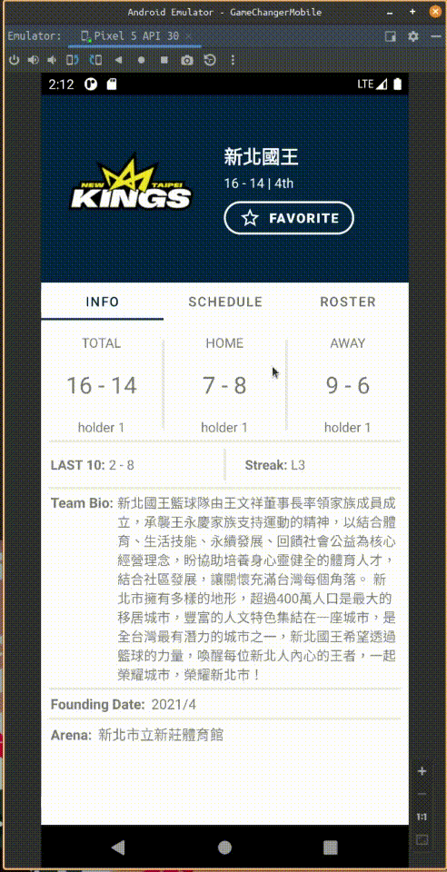
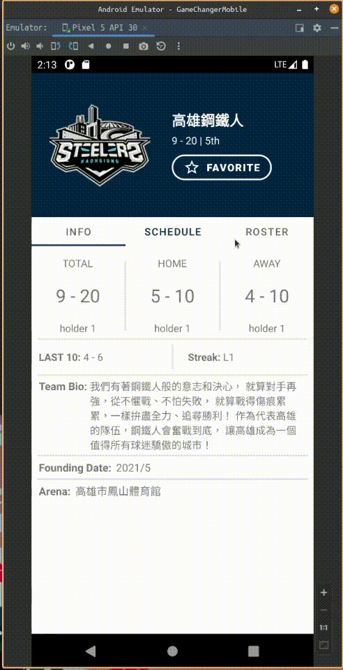
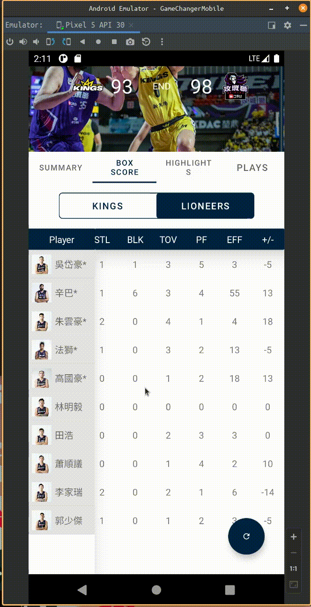
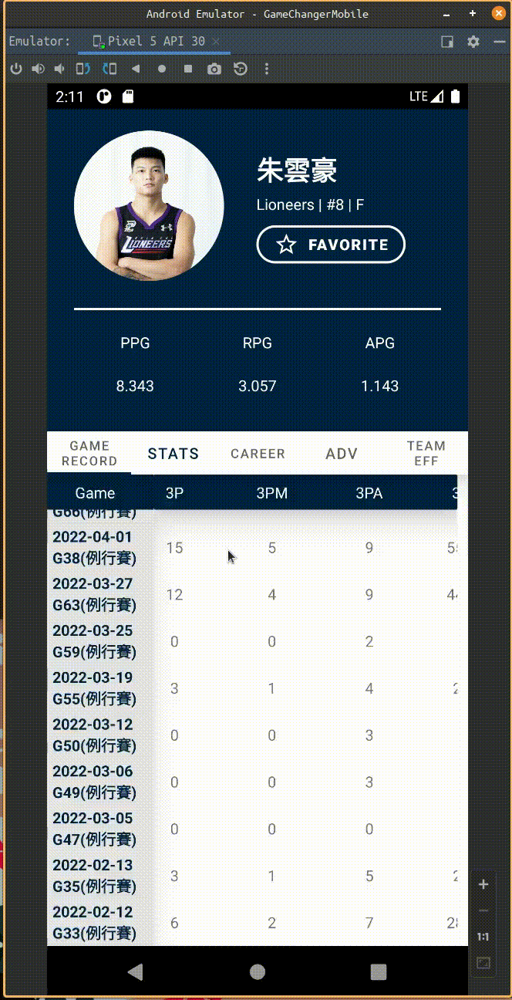
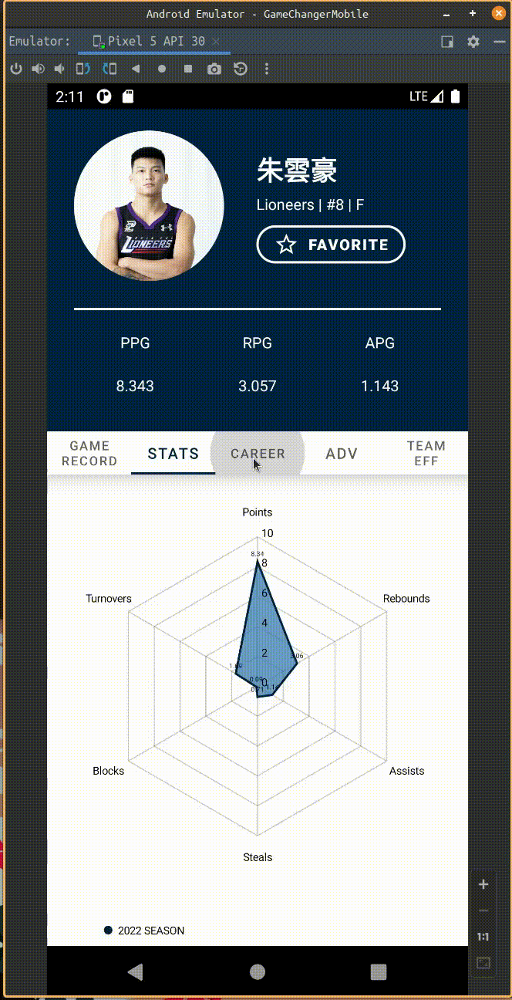
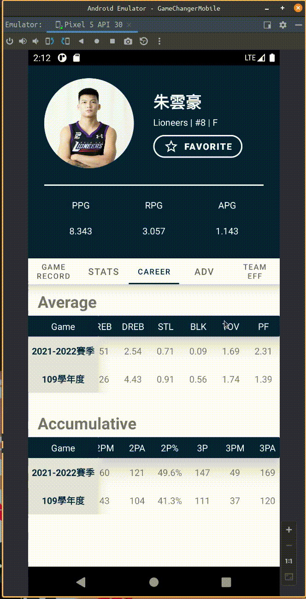
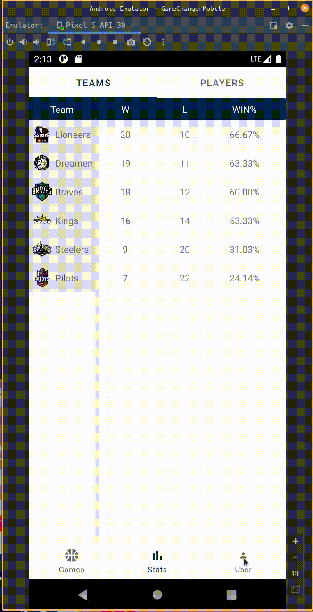

# PleagueMobile

## Booting up the App

## Game Cards

## Game Activity
### Game Summary

### Game Box Score

### Game Photo

## Team Activity
### Team Info

### Team Schedule

### Team Roster

## Player Page
### Player Record

### Player Stats RadarChart

### Player Career

### Player Advanced Stats and Team Efficiency

## User
### My Favorite Team

### My Favorite Player

